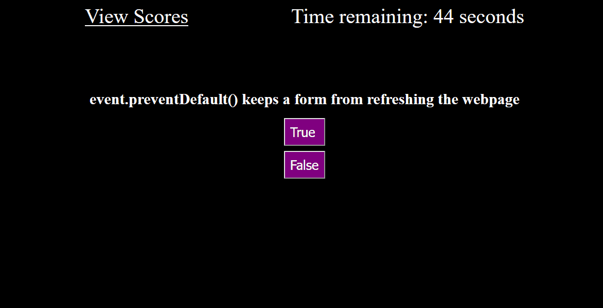

# Javascript Speed Quiz

## Description
Engage in a race against the clock to test your Javascript knowledge! The goal of this game is to answer as many questions as you can within the time limit. But any wrong answers will be deducted from your remaining time! At the end, you can submit your score to the leaderboard. (Disclaimer: leaderboard stored locally)

## Usage
Simply go to https://dshowarth.github.io/Module-4-Challenge/index.html and click 'New Game' to start quizzing

## Lessons Learned
- Modifying HTML with JavaScript can involve a lot of id attributes. Name them well so it doesn't get confusing
- getElementbyId() doesn't need the # to be attached to the id name (e.g. getElementbyId("#submit"))
- Objects are not sortable, but can be converted to an array with Object.entries() which is.
- If you have an external force changing the clock on a setInterval function, you need to cover the edge cases where the timer overshoots the value you want. 

## Credits
Gif captured with https://github.com/NickeManarin/ScreenToGif